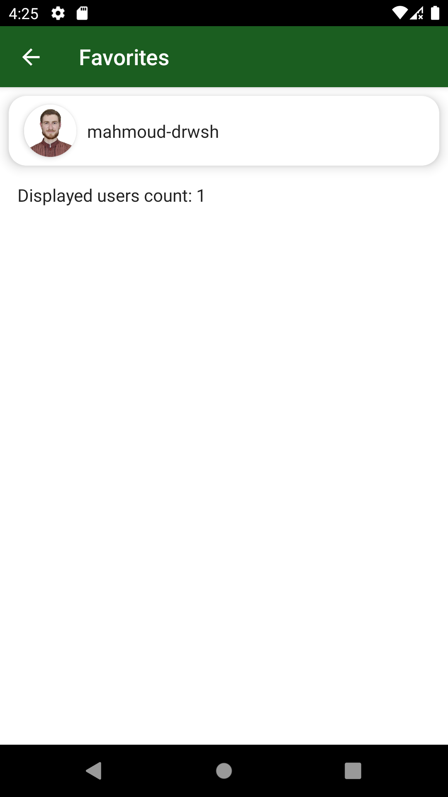

# Introduction   

Since GitHub API tokens are revoked automatically when uploaded to GitHub, I have included some screenshots and a video demonstrating how the app looks and is used. To build the app and run yourself, you'll need to generate a token yourself and place it in the gradle.properties file in the root directory of the project.

# Screenshots

| | | |
|:-|-|-|
| | |  |

# Demo

The following video is a short one demonstrating how the app is used.
https://youtube.com/shorts/cI1nRTRW8qM

# The following libraries were used in the writing of the app:
- Jetpack Hilt (for dependency injection)
- Jetpack Compose (for the UI)
- Jetpack SplashScreen 
- Jetpack ViewModel
- Kotlin Flow
- Compose Coil
- Retrofit (networking)
- Google's Gson (for JSON parsing)
- Google's Accompanist (for paging Composables)
- Jetpack Room
- Jetpack DataStore
